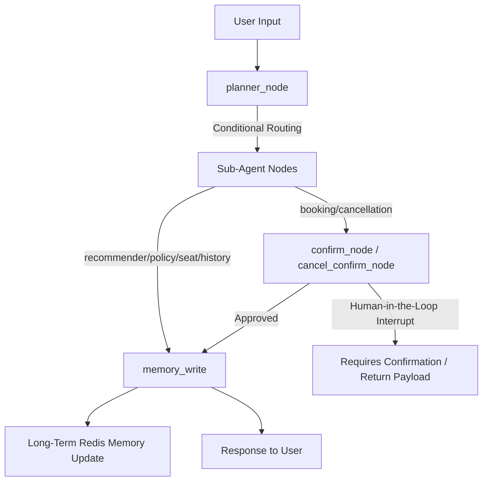

# Pipeline Improvements & Architecture Report
This document summarizes the key architectural decisions, bug fixes, and system improvements implemented to stabilize and optimize the **Agentic Movie Ticket Booking System** pipeline.

---

## 1. Executive Summary

During development, wiring, and integration phases, several critical bugs and compatibility issues were identified across the LangGraph, OpenAI/ChatAnywhere API, and RAG pipelines. This report documents the problems encountered, their root causes, and the concrete solutions applied to ensure a robust, production-grade, human-in-the-loop (HITL) agentic workflow.

### Overview of Improvements

| Category | Problem / Symptoms | Root Cause | Implemented Solution | Files Affected |
| :--- | :--- | :--- | :--- | :--- |
| **State Reducer** | **Message Duplication**<br>System output duplicated user/agent messages repeatedly in subsequent turns. | Non-agent nodes (`planner`, memory, confirm) returned the full state (`{**state}`), forcing the `messages` list reducer (`operator.add`) to duplicate history. | Updated all non-agent nodes to return **only** updated keys (e.g., `{}`) instead of copying the full state. | - [planner.py](file:///Users/tarunnagpal/Documents/agentic-movie-ticket-booking-system/src/agents/planner.py)<br>- [confirm.py](file:///Users/tarunnagpal/Documents/agentic-movie-ticket-booking-system/src/graph/nodes/confirm.py)<br>- [cancel_confirm.py](file:///Users/tarunnagpal/Documents/agentic-movie-ticket-booking-system/src/graph/nodes/cancel_confirm.py)<br>- [memory.py](file:///Users/tarunnagpal/Documents/agentic-movie-ticket-booking-system/src/agents/memory.py) |
| **LLM Schema** | **OpenAI API Schema Violations**<br>ChatAnywhere API threw errors because of mismatched `tool_calls` validation. | Message filtering stripped `ToolMessage`s but left preceding `AIMessage`s containing `tool_calls`. ChatAnywhere rejected dangling tool calls without their answers. | Filtered input messages to exclude both `ToolMessage`s and `AIMessage`s containing tool calls from agent contexts. | - All 6 sub-agents in `src/agents/` |
| **Data Parsing** | **Draft Extraction Failure**<br>The system bypassed the HITL confirmation step and never paused. | `booking` and `cancellation` agents checked `isinstance(content, dict)`, but LangChain's React Agent serializes tool output to JSON strings. | Added JSON deserialization block using `json.loads` before extracting draft payload. | - [booking.py](file:///Users/tarunnagpal/Documents/agentic-movie-ticket-booking-system/src/agents/booking.py)<br>- [cancellation.py](file:///Users/tarunnagpal/Documents/agentic-movie-ticket-booking-system/src/agents/cancellation.py) |
| **RAG Pipeline** | **Connection Failures & Outdated API Calls**<br>Redis connection errors; Qdrant search method deprecated. | Redis host URL typo (`locahost`); deprecated `client.search` method used; loading plain text instead of structured json. | Corrected `.env`, migrated Qdrant search to `query_points`, and restructured document indexer to parse `policy.json`. | - [indexer.py](file:///Users/tarunnagpal/Documents/agentic-movie-ticket-booking-system/src/rag/indexer.py)<br>- [retriever.py](file:///Users/tarunnagpal/Documents/agentic-movie-ticket-booking-system/src/rag/retriever.py)<br>- `.env` |
| **HITL Routing** | **Incomplete Graph & API Wiring**<br>Lack of coordination between sub-agents and REST API. | Nodes were disconnected; no clean HTTP interface to handle graph interrupts. | Created compiling StateGraph with conditional edges and a FastAPI server mapping `/chat` and `/chat/confirm`. | - [graph.py](file:///Users/tarunnagpal/Documents/agentic-movie-ticket-booking-system/src/graph/graph.py)<br>- [main.py](file:///Users/tarunnagpal/Documents/agentic-movie-ticket-booking-system/main.py) |
| **Guardrails** | **Off-Topic / Irrelevant Flow Confusion**<br>Irrelevant user queries routed to the movie booking agent node. | Default routing fallback was configured to send unknown intents to `booking_node`. | Refactored `planner_node` to construct a friendly rejection message and route directly to `END` on `Intent.UNKNOWN`. | - [planner.py](file:///Users/tarunnagpal/Documents/agentic-movie-ticket-booking-system/src/agents/planner.py)<br>- [router.py](file:///Users/tarunnagpal/Documents/agentic-movie-ticket-booking-system/src/graph/router.py)<br>- [graph.py](file:///Users/tarunnagpal/Documents/agentic-movie-ticket-booking-system/src/graph/graph.py) |
| **Frontend** | **No Visual UI**<br>System only had a FastAPI backend, making it hard to test/interact with. | Frontend interface was missing for human testing of multi-turn and HITL states. | Created a Streamlit frontend (`app.py`) with user/thread switching, movie display, and interactive HITL buttons. | - [app.py](file:///Users/tarunnagpal/Documents/agentic-movie-ticket-booking-system/app.py)<br>- [main.py](file:///Users/tarunnagpal/Documents/agentic-movie-ticket-booking-system/main.py) |

---

## 2. Detailed Improvement Breakdown

### A. LangGraph Message Duplication (State Reducer Fix)

#### Problem
In LangGraph, state updates are merged. The `messages` key utilizes an adder reducer (`Annotated[list, add]`), meaning any return value from a node that contains `messages` will append those messages to the list. 
Several utility nodes (e.g., `planner_node`, memory nodes, and confirmation nodes) returned `{**state}`. Because `state` already contained all historical messages, returning `{**state}` caused all previous messages to be appended to the state *again*, resulting in exponential message duplication in the chat history.

#### Solution
We refactored all non-agent nodes to return only the specific keys they updated. If a node does not modify state (or only reads state), it returns an empty dictionary `{}` or specific updated keys.

#### Code Comparison (Example: Confirm Node)
**Before:**
```python
def confirm_node(state: dict) -> dict:
    # ... processed confirm ...
    # This returned the entire state dictionary, including "messages", duplicating history!
    return {**state, "confirmed": True}
```

**After:**
```python
def confirm_node(state: dict) -> dict:
    draft = state.get("booking_draft")
    if not draft:
        return {} # Safe: no state change, no duplication

    decision = interrupt({
        "message": "Confirm your booking?",
        "data":    draft,
        "options": ["Approve", "Reject"]
    })

    if decision != "Approve":
        return {"booking_draft": None, "confirmed": False}

    # ... updates databases ...

    # Safe: returns ONLY changed keys, messages list is untouched
    return {"confirmed": True, "booking_draft": confirmed_draft}
```

---

### B. OpenAI API Schema Violations (Tool Call Pollution)

#### Problem
When sub-agents invoke their internal LLM chains, they inherit the message history from the state graph. Some previous turns included `AIMessage`s containing `tool_calls` arguments paired with `ToolMessage`s. If we filter out `ToolMessage`s to clean up the conversation, we leave dangling `AIMessage`s that claim to have executed a tool call but have no corresponding `ToolMessage` result in the context window.
OpenAI-compatible APIs (including ChatAnywhere) reject this with schema validation errors:
`Invalid API payload: assistant message contains tool calls but is not followed by tool message.`

#### Solution
We implemented a strict input message filter in all 6 sub-agents. Before invoking the LLM, the agents strip out:
1. All `ToolMessage` objects.
2. All `AIMessage` objects that contain `tool_calls` (dangling assistant calls).

This leaves a clean history consisting solely of `HumanMessage` inputs and text-only `AIMessage` responses.

```python
# Implemented in booking, cancellation, seat, policy, recommend, and history agents:
input_messages = [
    m for m in state.get("messages", [])
    if getattr(m, "type", None) == "human" 
    or (getattr(m, "type", None) == "ai" and not getattr(m, "tool_calls", None))
]
agent_state = {**state, "messages": input_messages}
result = booking_react_agent.invoke(agent_state)
```

---

### C. Tool JSON Deserialization Fix (Draft Detection)

#### Problem
The Human-in-the-Loop (HITL) interrupt depends on detecting whether a booking or cancellation draft was generated by an agent's tool.
The agent nodes were checking `isinstance(content, dict)` to extract the draft structure from the last message. However, the custom React agent wrapper writes tool responses to `ToolMessage.content` as **JSON-serialized strings**, not Python dicts. Consequently, `isinstance(content, dict)` always evaluated to `False`, drafts were never detected, and the interrupt was completely bypassed.

#### Solution
We updated both [booking.py](file:///Users/tarunnagpal/Documents/agentic-movie-ticket-booking-system/src/agents/booking.py) and [cancellation.py](file:///Users/tarunnagpal/Documents/agentic-movie-ticket-booking-system/src/agents/cancellation.py) to attempt a JSON deserialization using `json.loads` if `content` is a string.

```python
# Try to deserialize content if it is a serialized string
for msg in reversed(result["messages"]):
    content = getattr(msg, "content", None)
    if isinstance(content, str):
        import json
        try:
            content = json.loads(content)
        except Exception:
            pass
            
    # Now check if it is a dictionary containing the draft data
    if isinstance(content, dict) and content.get("status") == "draft":
        booking_draft = content.get("booking_draft")
        break
```

---

### D. RAG Pipeline Configuration and API Upgrades

#### Problem
1. **Redis Typo**: The configuration `.env` file contained `redis://locahost:6379`, causing startup connection timeouts.
2. **Text Indexing**: The indexer loaded a raw unstructured `policy.txt` text file, which failed to map well into structured metadata.
3. **Qdrant API Deprecation**: The Qdrant client used deprecated methods (`client.search`) that threw warnings/exceptions in modern `qdrant-client` versions.

#### Solution
- Corrected the Redis URL in `.env` to `redis://localhost:6379`.
- Refactored [indexer.py](file:///Users/tarunnagpal/Documents/agentic-movie-ticket-booking-system/src/rag/indexer.py) to load `data/policy.json` containing pre-chunked policy topics and metadata.
- Migrated Qdrant queries to the modern `client.query_points` API inside [retriever.py](file:///Users/tarunnagpal/Documents/agentic-movie-ticket-booking-system/src/rag/retriever.py).

```python
# retriever.py upgrade
results = client.query_points(
    collection_name=COLLECTION_NAME,
    query=query_vector,
    limit=limit
)
```

---

### E. Off-Topic / Irrelevant Query Guardrails

#### Problem
In the initial multi-agent design, if a user query was off-topic or irrelevant (e.g. asking for recipe instructions or talking about unrelated news), the `planner_node` classified it as `Intent.UNKNOWN`. 
However, the LangGraph routing function `route_agent` defaulted to `"booking_node"` on any unhandled agent name. Consequently, irrelevant queries were sent directly to the movie booking agent. The booking agent would then try to invoke movie-finding tools or hallucinate shows, causing a degraded user experience.

#### Solution
1. **Short-Circuiting to END**: If `Intent.UNKNOWN` is detected by the planner, the graph sets `next_agent` to `"unknown"`, and the router routes `"unknown"` directly to `END`, immediately ending execution without invoking sub-agents.
2. **Dynamic Conversational Refusal (Option 2)**: Instead of returning a hardcoded fallback string or forcing structured output schemas to generate natural conversation, the `planner_node` invokes a secondary, unstructured LLM call. This call is passed the user's input with a dedicated system prompt to generate a highly personalized, context-aware refusal message that directly references their topic (e.g., cookie recipes) and guides them back to movie booking.

```python
# In src/agents/planner.py
if response.intent == Intent.UNKNOWN or next_agent == "unknown":
    # Extract the last human message content for context
    user_message_content = ""
    for m in reversed(messages):
        if getattr(m, "type", None) == "human":
            user_message_content = getattr(m, "content", "")
            break

    refusal_prompt = f"""You are a helpful and polite movie ticket booking assistant.
The user asked: "{user_message_content}"
This request is off-topic or irrelevant to movie booking, showtimes, seats, ticket cancellations, or movie-theater policies.
Politely inform the user that you can only assist with movie ticket booking related questions, and gently steer them back.
Directly reference what they asked in a natural way so they know you understood their input, but explain why you cannot help with it.
Keep your response friendly, concise, and helpful.
"""
    refusal_response = llm.invoke([
        {"role": "system", "content": refusal_prompt}
    ])
    res["messages"] = [AIMessage(content=refusal_response.content)]
```

---

## 3. System Architecture & Flow Control

The final system uses **LangGraph** to coordinate multi-agent interaction with the following topology:



### LangGraph Integration Details
- **State Checkpointing**: Using Redis-backed checkpointing to save conversation thread states.
- **State Schema**: Shared `BookingState` containing lists of messages, current user context (`city`, `user_id`), current active `booking_draft`, `cancel_draft`, and confirmation flags.
- **REST API mapping**: FastAPI endpoints `/chat` and `/chat/confirm` handle execution resumption:
  - `/chat`: Sends new message, executes graph until completion or interrupt.
  - `/chat/confirm`: Resumes the paused thread with an `"Approve"` or `"Reject"` input command.

---

## 4. Verification and Validation Results

We verified the pipeline by running complete end-to-end integration tests using mock API requests:

### Scenario A: Booking Flow Verification
1. **Request**: Booking seat `E5` for show `s101`.
2. **Result**: Graph paused at `confirm_node` with status `requires_confirmation`, generating:
   ```json
   {
     "status": "requires_confirmation",
     "interrupt": {
       "message": "Confirm your booking?",
       "data": {
         "booking_id": "b_006",
         "movie_id": "m101",
         "show_id": "s101",
         "seats": ["E5"],
         "price": 450.0
       }
     }
   }
   ```
3. **Resumption**: Calling `/chat/confirm` with `Approve` successfully processed the payment, flipped seat `E5` to `booked` in `showtimes.json`, and stored the booking as `confirmed` in `bookings.json`.

### Scenario B: Cancellation Flow Verification
1. **Request**: Cancelling booking `b_006`.
2. **Result**: The system looked up booking details, computed a `90%` refund because the cancellation occurred > 24 hours in advance, and paused:
   ```json
   {
     "status": "requires_confirmation",
     "interrupt": {
       "message": "Cancel booking for 2025-06-01 at 10:00? Refund: \u20b9405.0 (Full refund (90%) \u2014 cancelled more than 24 hours before show.)"
     }
   }
   ```
3. **Resumption**: Calling `/chat/confirm` with `Approve` successfully updated the booking status to `cancelled`, processed the refund, and released seat `E5` back to `available` in the database.

### Scenario C: Off-Topic/Irrelevant Query Guardrail Verification
1. **Request**: User asks: *"Can you give me a recipe for chocolate chip cookies?"*
2. **Result**: The `planner_node` detects the intent is out of scope (`Intent.UNKNOWN`). It generates a polite explanation and exits immediately (`status: success`) without executing sub-agents or calling tools:
   ```json
   {
     "status": "success",
     "messages": [
       {
         "role": "user",
         "content": "Can you give me a recipe for chocolate chip cookies?"
       },
       {
         "role": "assistant",
         "content": "I'm here to help with movie bookings, showtimes, seats, history, or policies. How can I assist you with one of those?"
       }
     ]
   }
   ```

---
*Report compiled successfully.*
